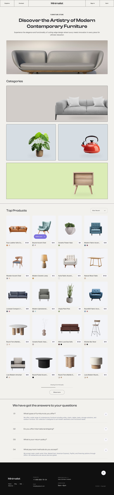

# Minimalist Furniture E-Commerce

Welcome to the Minimalist Furniture E-Commerce project! This application is designed to showcase a collection of stylish and minimalistic furniture products, allowing users to browse, add items to their cart, and purchase them seamlessly.

 <!-- Replace with your project image -->

## Table of Contents

- [Features](#features)
- [Tech Stack](#tech-stack)
- [Figma Design File](#figma-design-file)
- [Installation](#installation)
- [Usage](#usage)
- [Contributing](#contributing)
- [License](#license)

## Features

- Browse a variety of minimalist furniture items.
- User authentication for a personalized shopping experience.
- Add items to the shopping cart and proceed to checkout.
- Responsive design for optimal viewing on all devices.

## Tech Stack

- **Frontend:** 
  - [React](https://reactjs.org/) - A JavaScript library for building user interfaces.
  - [Tailwind CSS](https://tailwindcss.com/) - A utility-first CSS framework for rapid UI development.
  
- **Backend:** 
  - Node js using Molecular Framework

## Figma Design File

The design for this project was created using Figma. You can access the design file here:

[Figma Design File]([link_to_your_figma_file](https://www.figma.com/proto/WJWtAlkgqVaM0eYS5E10N9/Minimalist-Ecommerce-Project?node-id=3-79&t=YtqCKOHxDjraRfHW-1)) <!-- Replace with your Figma link -->

## Installation

To get a local copy up and running, follow these steps:

1. Clone the repository:

   ```bash
   git clone https://github.com/yourusername/minimalist-furniture-ecommerce.git
